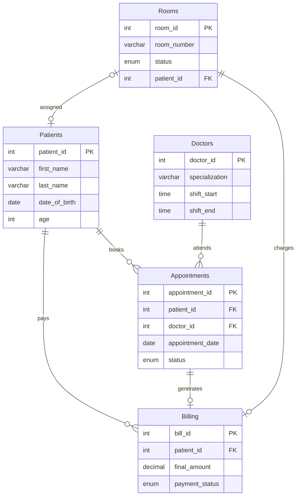
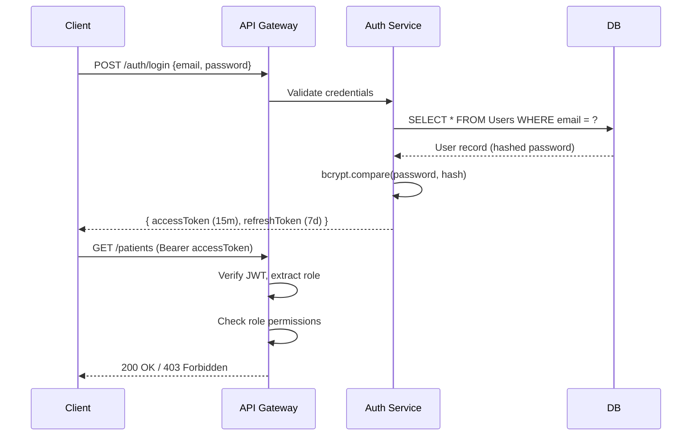

# Hospital Management System — Backend Blueprint

## 1. Schema Definition

### 1.1 Patients

```sql
CREATE TABLE Patients (
    patient_id      INT             PRIMARY KEY AUTO_INCREMENT,
    first_name      VARCHAR(100)    NOT NULL,
    last_name       VARCHAR(100)    NOT NULL,
    date_of_birth   DATE            NOT NULL,
    age             INT             NOT NULL CHECK (age > 0 AND age < 150),
    gender          ENUM('Male','Female','Other') NOT NULL,
    phone           VARCHAR(20)     NOT NULL UNIQUE,
    email           VARCHAR(150)    UNIQUE,
    address         TEXT,
    blood_group     ENUM('A+','A-','B+','B-','AB+','AB-','O+','O-'),
    emergency_contact VARCHAR(20),
    created_at      TIMESTAMP       DEFAULT CURRENT_TIMESTAMP,
    updated_at      TIMESTAMP       DEFAULT CURRENT_TIMESTAMP ON UPDATE CURRENT_TIMESTAMP
);
```

### 1.2 Doctors

```sql
CREATE TABLE Doctors (
    doctor_id       INT             PRIMARY KEY AUTO_INCREMENT,
    first_name      VARCHAR(100)    NOT NULL,
    last_name       VARCHAR(100)    NOT NULL,
    specialization  VARCHAR(100)    NOT NULL,
    phone           VARCHAR(20)     NOT NULL UNIQUE,
    email           VARCHAR(150)    NOT NULL UNIQUE,
    license_number  VARCHAR(50)     NOT NULL UNIQUE,
    shift_start     TIME            NOT NULL,
    shift_end       TIME            NOT NULL,
    is_active       BOOLEAN         DEFAULT TRUE,
    created_at      TIMESTAMP       DEFAULT CURRENT_TIMESTAMP
);
```

### 1.3 Rooms

```sql
CREATE TABLE Rooms (
    room_id         INT             PRIMARY KEY AUTO_INCREMENT,
    room_number     VARCHAR(10)     NOT NULL UNIQUE,
    room_type       ENUM('General','Semi-Private','Private','ICU','Operation') NOT NULL,
    floor           INT             NOT NULL CHECK (floor >= 0),
    status          ENUM('Available','Occupied','Maintenance') DEFAULT 'Available',
    daily_rate      DECIMAL(10,2)   NOT NULL CHECK (daily_rate >= 0),
    patient_id      INT             NULL,
    FOREIGN KEY (patient_id) REFERENCES Patients(patient_id) ON DELETE SET NULL
);
```

### 1.4 Appointments

```sql
CREATE TABLE Appointments (
    appointment_id  INT             PRIMARY KEY AUTO_INCREMENT,
    patient_id      INT             NOT NULL,
    doctor_id       INT             NOT NULL,
    appointment_date DATE           NOT NULL,
    start_time      TIME            NOT NULL,
    end_time        TIME            NOT NULL,
    status          ENUM('Scheduled','Completed','Cancelled','No-Show')
                                    DEFAULT 'Scheduled',
    reason          TEXT,
    notes           TEXT,
    created_at      TIMESTAMP       DEFAULT CURRENT_TIMESTAMP,

    FOREIGN KEY (patient_id) REFERENCES Patients(patient_id) ON DELETE CASCADE,
    FOREIGN KEY (doctor_id)  REFERENCES Doctors(doctor_id)   ON DELETE CASCADE,

    CHECK (end_time > start_time)
);

-- Prevent double-booking a doctor for overlapping slots
CREATE UNIQUE INDEX idx_doctor_slot
    ON Appointments (doctor_id, appointment_date, start_time);
```

### 1.5 Billing

```sql
CREATE TABLE Billing (
    bill_id         INT             PRIMARY KEY AUTO_INCREMENT,
    patient_id      INT             NOT NULL,
    appointment_id  INT,
    room_id         INT,
    total_amount    DECIMAL(12,2)   NOT NULL DEFAULT 0.00 CHECK (total_amount >= 0),
    discount        DECIMAL(5,2)    DEFAULT 0.00 CHECK (discount >= 0 AND discount <= 100),
    tax_rate        DECIMAL(5,2)    DEFAULT 0.00,
    final_amount    DECIMAL(12,2)   GENERATED ALWAYS AS
                        (total_amount * (1 - discount/100) * (1 + tax_rate/100)) STORED,
    payment_status  ENUM('Pending','Paid','Partially Paid','Refunded') DEFAULT 'Pending',
    payment_method  ENUM('Cash','Card','Insurance','Online'),
    billing_date    TIMESTAMP       DEFAULT CURRENT_TIMESTAMP,

    FOREIGN KEY (patient_id)     REFERENCES Patients(patient_id),
    FOREIGN KEY (appointment_id) REFERENCES Appointments(appointment_id),
    FOREIGN KEY (room_id)        REFERENCES Rooms(room_id)
);
```

### ER Diagram



---

## 2. RESTful API Endpoints

> [!NOTE]
> All endpoints below assume a base URL of `/api/v1`. Every request must include an `Authorization: Bearer <JWT>` header except for `/auth/login`.

### 2.1 Authentication

| Method | Endpoint | Description | Access |
|--------|----------|-------------|--------|
| `POST` | `/auth/login` | Authenticate and receive JWT | Public |
| `POST` | `/auth/refresh` | Refresh an expiring token | Any role |

### 2.2 Patients

| Method | Endpoint | Description | Access |
|--------|----------|-------------|--------|
| `POST` | `/patients` | Register a new patient | Admin, Receptionist |
| `GET` | `/patients` | List patients (paginated) | Admin, Doctor, Receptionist |
| `GET` | `/patients/:id` | Get patient details | Admin, Doctor, Receptionist |
| `PUT` | `/patients/:id` | Update patient info | Admin, Receptionist |
| `DELETE` | `/patients/:id` | Soft-delete a patient | Admin |

### 2.3 Appointments

| Method | Endpoint | Description | Access |
|--------|----------|-------------|--------|
| `POST` | `/appointments` | Book an appointment | Admin, Receptionist |
| `GET` | `/appointments` | List appointments (filterable) | Admin, Doctor, Receptionist |
| `GET` | `/appointments/:id` | Get appointment detail | Admin, Doctor, Receptionist |
| `PATCH` | `/appointments/:id/status` | Update status | Admin, Doctor |
| `DELETE` | `/appointments/:id` | Cancel appointment | Admin, Receptionist |
| `GET` | `/doctors/:id/availability?date=YYYY-MM-DD` | Check doctor slots | Admin, Receptionist |

### 2.4 Rooms

| Method | Endpoint | Description | Access |
|--------|----------|-------------|--------|
| `GET` | `/rooms` | List rooms with status | Admin, Receptionist |
| `POST` | `/rooms/:id/admit` | Admit patient to room | Admin, Receptionist |
| `POST` | `/rooms/:id/discharge` | Discharge patient | Admin, Receptionist |
| `PATCH` | `/rooms/:id` | Update room info | Admin |

### 2.5 Billing

| Method | Endpoint | Description | Access |
|--------|----------|-------------|--------|
| `POST` | `/billing` | Generate a final bill | Admin, Receptionist |
| `GET` | `/billing/:id` | Get bill details | Admin, Receptionist |
| `PATCH` | `/billing/:id/pay` | Record payment | Admin, Receptionist |
| `GET` | `/patients/:id/bills` | Patient billing history | Admin, Receptionist |

---

## 3. Key API Logic (Pseudocode)

### 3.1 Register a New Patient — `POST /patients`

```
function registerPatient(req):
    validate(req.body)                       // first_name, last_name, dob, phone required
    if Patients.exists(phone = req.body.phone):
        return 409 "Patient already registered"
    patient = Patients.insert(req.body)
    return 201 { patient }
```

### 3.2 Book an Appointment — `POST /appointments`

```
function bookAppointment(req):
    { patient_id, doctor_id, date, start_time, end_time, reason } = req.body

    -- Step 1: Verify doctor exists and is active
    doctor = Doctors.findById(doctor_id)
    if !doctor or !doctor.is_active:
        return 404 "Doctor not found or inactive"

    -- Step 2: Check requested time is within doctor's shift
    if start_time < doctor.shift_start OR end_time > doctor.shift_end:
        return 400 "Outside doctor's working hours"

    -- Step 3: Check for overlapping appointments
    conflict = Appointments.find(
        doctor_id = doctor_id,
        date      = date,
        status   != 'Cancelled',
        overlaps(start_time, end_time)
    )
    if conflict:
        return 409 "Doctor is not available at this time"

    -- Step 4: Insert
    appointment = Appointments.insert({ ... , status: 'Scheduled' })
    return 201 { appointment }
```

### 3.3 Admit / Discharge — `POST /rooms/:id/admit`

```
function admitPatient(req):
    room = Rooms.findById(req.params.id)
    if room.status != 'Available':
        return 409 "Room is not available"

    Rooms.update(room_id, { status: 'Occupied', patient_id: req.body.patient_id })
    return 200 { room }

function dischargePatient(req):
    room = Rooms.findById(req.params.id)
    Rooms.update(room_id, { status: 'Available', patient_id: NULL })
    return 200 { room }
```

### 3.4 Generate Final Bill — `POST /billing`

```
function generateBill(req):
    { patient_id, appointment_id, room_id, items } = req.body

    total = sum(items.amount)
    if room_id:
        room = Rooms.findById(room_id)
        days = calculateStayDays(patient_id, room_id)
        total += room.daily_rate * days

    bill = Billing.insert({
        patient_id, appointment_id, room_id,
        total_amount: total,
        discount: req.body.discount ?? 0,
        tax_rate: req.body.tax_rate ?? 0
    })
    return 201 { bill }
```

---

## 4. Business Logic — Triggers & Stored Procedures

### 4.1 Trigger: Auto-mark Room as Occupied

```sql
DELIMITER $$

CREATE TRIGGER trg_room_occupy
AFTER UPDATE ON Rooms
FOR EACH ROW
BEGIN
    -- When a patient is assigned to a room, ensure status is 'Occupied'
    IF NEW.patient_id IS NOT NULL AND OLD.patient_id IS NULL THEN
        UPDATE Rooms
           SET status = 'Occupied'
         WHERE room_id = NEW.room_id
           AND status != 'Occupied';
    END IF;

    -- When a patient is removed, mark room 'Available'
    IF NEW.patient_id IS NULL AND OLD.patient_id IS NOT NULL THEN
        UPDATE Rooms
           SET status = 'Available'
         WHERE room_id = NEW.room_id
           AND status != 'Available';
    END IF;
END$$

DELIMITER ;
```

> [!TIP]
> An alternative design uses a `BEFORE UPDATE` trigger to set `NEW.status` directly, avoiding recursive updates:

```sql
DELIMITER $$

CREATE TRIGGER trg_room_auto_status
BEFORE UPDATE ON Rooms
FOR EACH ROW
BEGIN
    IF NEW.patient_id IS NOT NULL AND OLD.patient_id IS NULL THEN
        SET NEW.status = 'Occupied';
    ELSEIF NEW.patient_id IS NULL AND OLD.patient_id IS NOT NULL THEN
        SET NEW.status = 'Available';
    END IF;
END$$

DELIMITER ;
```

### 4.2 Stored Procedure: Doctor's Daily Schedule

```sql
DELIMITER $$

CREATE PROCEDURE sp_get_doctor_daily_schedule(
    IN  p_doctor_id INT,
    IN  p_date      DATE
)
BEGIN
    SELECT
        a.appointment_id,
        a.start_time,
        a.end_time,
        a.status,
        a.reason,
        p.patient_id,
        CONCAT(p.first_name, ' ', p.last_name) AS patient_name,
        p.phone AS patient_phone
    FROM Appointments a
    JOIN Patients p ON a.patient_id = p.patient_id
    WHERE a.doctor_id = p_doctor_id
      AND a.appointment_date = p_date
      AND a.status != 'Cancelled'
    ORDER BY a.start_time;
END$$

DELIMITER ;

-- Usage:
-- CALL sp_get_doctor_daily_schedule(1, '2026-05-01');
```

---

## 5. Security — Authentication & Authorization

### 5.1 Architecture Overview



### 5.2 Users Table

```sql
CREATE TABLE Users (
    user_id       INT             PRIMARY KEY AUTO_INCREMENT,
    email         VARCHAR(150)    NOT NULL UNIQUE,
    password_hash VARCHAR(255)    NOT NULL,
    role          ENUM('Admin','Doctor','Receptionist') NOT NULL,
    linked_id     INT,            -- doctor_id for Doctor role, NULL otherwise
    is_active     BOOLEAN         DEFAULT TRUE,
    created_at    TIMESTAMP       DEFAULT CURRENT_TIMESTAMP
);
```

### 5.3 JWT Strategy

| Aspect | Recommendation |
|--------|---------------|
| **Hashing** | `bcrypt` with cost factor 12 |
| **Access Token** | JWT, 15-minute expiry, contains `{ user_id, role }` |
| **Refresh Token** | Opaque token stored in DB, 7-day expiry, rotated on use |
| **Storage** | Access token in memory; refresh token in `HttpOnly` + `Secure` cookie |
| **Signing** | RS256 (asymmetric) for production; HS256 acceptable for dev |

### 5.4 Role-Based Access Control (RBAC) Middleware

```
function authorize(...allowedRoles):
    return (req, res, next):
        token = req.headers.authorization?.split(' ')[1]
        if !token: return 401

        payload = jwt.verify(token, SECRET_KEY)
        if payload.role not in allowedRoles:
            return 403 "Insufficient permissions"

        req.user = payload
        next()

-- Usage on routes:
router.post('/patients', authorize('Admin', 'Receptionist'), registerPatient)
router.get('/appointments', authorize('Admin', 'Doctor', 'Receptionist'), listAppointments)
```

### 5.5 Permission Matrix

| Resource | Admin | Doctor | Receptionist |
|----------|:-----:|:------:|:------------:|
| Manage Users | ✅ | ❌ | ❌ |
| Register Patient | ✅ | ❌ | ✅ |
| View Patient Records | ✅ | ✅ (own) | ✅ |
| Book/Cancel Appointment | ✅ | ❌ | ✅ |
| Update Appointment Status | ✅ | ✅ (own) | ❌ |
| Admit/Discharge Rooms | ✅ | ❌ | ✅ |
| Generate/View Bills | ✅ | ❌ | ✅ |

---

## 6. Additional Recommendations

> [!IMPORTANT]
> **Indexing** — Add indexes on frequently queried columns to avoid full table scans in production:

```sql
CREATE INDEX idx_appt_doctor_date ON Appointments(doctor_id, appointment_date);
CREATE INDEX idx_appt_patient     ON Appointments(patient_id);
CREATE INDEX idx_billing_patient   ON Billing(patient_id);
CREATE INDEX idx_rooms_status      ON Rooms(status);
```

> [!WARNING]
> **Soft Deletes** — Never hard-delete medical records. Add an `is_deleted` flag and filter in queries. This is critical for legal compliance.

| Area | Recommendation |
|------|---------------|
| **Input Validation** | Use a schema validator (Joi, Zod, express-validator) on every endpoint |
| **Rate Limiting** | Apply per-IP rate limiting (e.g., 100 req/min) on auth endpoints |
| **Audit Logging** | Log all write operations with `user_id`, `timestamp`, and `action` |
| **HTTPS** | Enforce TLS in production; reject plain HTTP |
| **CORS** | Whitelist only your frontend origin |
| **Database** | Use parameterized queries / ORM to prevent SQL injection |
